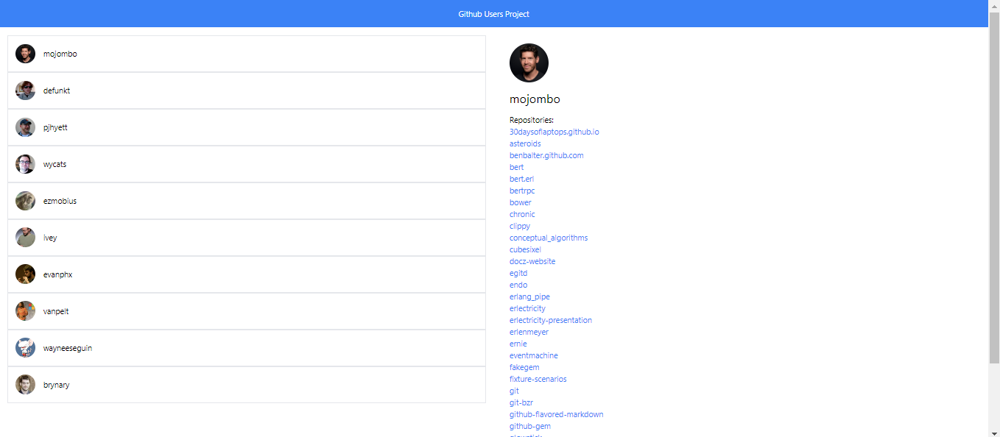

# Projet Utilisateurs GitHub

Ce projet est une application web développée avec React et TypeScript, utilisant l'API GitHub pour afficher les informations des utilisateurs et leurs dépôts.

## Technologies utilisées

- **Framework**: React avec TypeScript
- **CSS Framework**: Tailwind CSS

## Fonctionnalités

L'application comporte les fonctionnalités suivantes :

- Affichage d'une liste de cartes d'utilisateurs GitHub.
- Sélection d'un utilisateur pour afficher des informations détaillées dans une grande carte à droite.
- Affichage du nom, de l'avatar et des dépôts de l'utilisateur sélectionné.
- Possibilité d'ouvrir les liens des dépôts dans un nouvel onglet.

## Déploiement

Le projet est déployé sur GitHub Pages pour une démonstration en ligne.

[Accéder au projet déployé](https://github.com/jordanDev34/users_project/tree/main/github-users)

## Instructions pour le développement

### Installation

1. Clonez le projet sur votre machine locale :

   ```bash
   git clone https://github.com/jordanDev34/users_project/tree/main/github-users
   cd github-users
   ```

2. Installez les dépendances :
   ```bash
   npm install
   ```

### Exécution
Pour démarrer l'application localement :
   ```bash
   npm start
   ```

Cela lancera l'application en mode développement. Ouvrez http://localhost:3000 dans votre navigateur pour voir l'application.

### Personnalisation et Développement
Vous pouvez modifier le code source dans le répertoire src selon vos besoins. Voici une vue d'ensemble des composants principaux :

- Header: En-tête de l'application.
- Footer: Pied de page affichant les informations de copyright.
- UserList: Liste des utilisateurs GitHub avec leurs cartes.
- UserDetail: Détails d'un utilisateur sélectionné, y compris ses dépôts.

### Contribution
Les contributions sont les bienvenues ! N'hésitez pas à ouvrir une pull request pour proposer des améliorations ou des correctifs.

### Exemple en image
Affichage de 10 utilisateurs github sous forme de carte


Affichage du détail d'une carte lorsque l'on clique dessus

